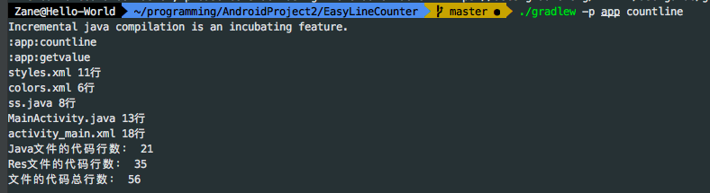

# EasyLineCounter
EasyLineCounter是一个统计Android工程代码行数的gradle插件

# Dependency
+ 在Project的build.gradle中
```groovy
dependencies {
        classpath 'com.zane:easylinecounter:1.0.0'
        ...
}
```
+ 在Module的build.gradle中
```groovy
apply plugin: 'com.zane.easylinecounter'
```

# Usage
默认统计/app/src/main/java，/app/src/main/res/layout路径下的所有文件的代码行数，可以在build.gradle中通过代码块添加其他的统计文件

执行以下命令：
```shell
./gradlew -p [module name] countline
```

添加其他文件：
```groovy
countpath {
    filepaths = ['/app/src/main/res/values/styles.xml',
                 '/app/src/main/res/values/colors.xml']
}
```

默认在执行assemble任务的时候，会自带执行统计代码行数的任务



### Just For Fun
